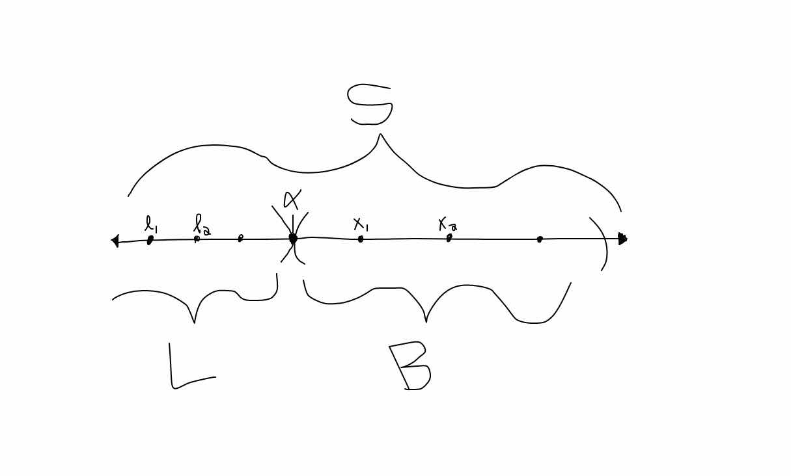

# Major Theorems

## The Equivalence of the Supremum of Lower Bounds and Infimum of Sets

The first theorem in this chapter is an excellent example of how visuals can be very helpful.  We have:

**Theorem 1. (Rudin 1.11)**:  Suppose $S$ is an ordered set with the **least-upper-bound** property, $B \subset S$, $B$ is not empty, and $B$ is bounded below. Let $L$ be the set of all lower bounds of $B$. Then
$$α = \sup L$$
exists in $S$, and $α= \inf B$ exists in $S.$

The above theorem can be captured in the below picture:

Note that $S$ is an ordered set, so relations like $x_1 < x_2, \forall x_1, x_2 \in S$ are well defined.  Further, $B$ is not empty (there exist $x_i$ like the points drawn in $B$), and $L$ must not be empty (since $B$ is bounded below by $L$).  Therefore, if we let $l_1 \in L$, then $l_1$ must be lower than any $x_i \in B$.  Similarly, any $x_i \in B$ must be greater than all of the $l_i \in L$.  Thus, $L$ is bounded from above.  

Now, we know that $S$ has the least-upper-bound property by assumption.  Therefore, there must exist a supremum of the set $L$, $\alpha$, within $S$.  By definition, this means that any element $l_i < \alpha$ is in $L$, and importantly not in $B$.  This implies that $\alpha \leq x \forall x \in B$, which in turn means $\alpha \in L$.    

We also know that every element $x_i > \alpha$ is not in $L$ since $\alpha$ is an upper bound for $L$.  This implies that any $x_i > \alpha$ is not a lower bound for $B$, or that $\alpha$ is the largest lower bound for $B$.  By definition, this makes $\alpha = \inf B$.  

Note that in the above picture, $\alpha$ does not necessarily have to be in $B$, especially in the event where there is a closed hole above $\alpha$.  However, the image makes the relationship between the supremum and infimum much clearer.  

## The Triangle Inequality

Another classic theorem from Rudin's first chapter is the following:

**Theorem 2 (Rudin 1.37)**: Let $\vec{x}, \vec{y} \in \mathbb{R}^k$.  Then

$$|\vec{x} + \vec{y}| \leq |\vec{x}| + |\vec{y}|. $$

This is called the triangle inequality, and the reason behind this name should hopefully become clear after the following image.  Note that $\| \vec{x} \|$ can be interpreted as the magnitude (or length) of the vector $\vec{x}$.

Looking at the instance where $k = 2$, if we interpret $\vec{x}$ as just one leg of a triangle, and $\vec{y}$ as a second leg of that same triangle, then, from vector addition, we get that the third leg of that same triangle is just $\vec{x} + \vec{y}$.  Take a look at the below image.  

Note that at the far left, the length of the third leg of the triangle (corresponding to a very acute angle between $\vec{x}$ and $\vec{y}$) is very small relative to the lengths of the other two legs.  However, if we increase our angle between $\vec{x}$ and $\vec{y}$ so that they are now parallel to one another, we maximize the length of $\vec{x} + \vec{y}$.  Visually, it makes sense that the longest $\vec{x} + \vec{y}$ can be is just the sum of the other two legs of the triangle.  Therefore, we get the inequality stated above.  

# Select Problems
## Relationship between Rationals and Irrationals

**(Rudin 1.1)** If $r$ is rational ( $r \neq 0$ ) and $x$ is irrational, prove that $r + x$ and $rx$ are irrational.

We can prove both statements by contradiction.  First, assume $r + x$ is rational.  Then, since the rationals are a field and closed under addition, we must have $-r + r + x = 0 + x = x \in Q$, which is a contradiction since $x$ was given to be irrational.  Therefore, $r + x$ must be irrational.  

Similarly, assume $rx$ is rational.  Then since the rationals are closed under multiplication, we get $(\frac{1}{r})rx = 1x = x \in Q$ which is another contradiction.  Therefore, we must have that $rx$ is irrational.  

## 12 Has No Square

**(Rudin 1.2)** Prove that there is no rational number whose square is 12.

Let's prove this by contradiction.  Assume that there is a rational number $x = \frac{m}{n}$ such that $m$ and $n$ are relatively prime (share no common factors other than 1) whose square is 12.  Then we must have $m^2 = 3 \cdot 2^2 n^2$.  Since there is a 3 on the RHS, this implies that $m$ is divisible by 3.  Let $m = 3\cdot a$.  Then we get $3^2\cdot a^2 = 3\cdot 2^2n^2 \Rightarrow 3\cdot a^2 = 2^2\cdot n^2$.  This in turn implies that $n$ is divisible by 3.  However, this yields a contradiction since we assumed $m$ and $n$ were relatively prime.  Thus, our assumption must be incorrect, and there does not exist such a rational number $x$.  

## Infimum, Supremum, and Negatives

**(Rudin 1.5)** Let $A$ be a nonempty set of real numbers which is bounded below.  Let $-A$ be the set of all numbers $-x$, where $x \in A$.  Prove that

$$\inf A = - \sup(-A).$$

Let's start with the below picture:

There should be some symmetry between $A$ and $-A$ about 0, where elements $x_1 < x_2$ in $A$ correspond to $-x_1 > -x_2$ in $-A$.  Therefore, it makes sense that a lower bound just becomes the negative of an upper bound, but let's formalize this further.  

Let $\alpha = \inf A$.  Then $\alpha \leq x \forall x \in A$, but if $y > \alpha$, then there is an $x \in A$ such that $\alpha < x < y$.  However, multiplying these inequalities by -1 yields $-\alpha \geq -x \forall x \in A$.  Note that this means $-\alpha \geq -x \forall -x \in -A$ by definition of $-A$.  Thus, $-A$ is bounded above by $-\alpha$.  

The second inequality with $y$, initially greater than $\alpha$ now yields $-y < -\alpha$.  Further, we have that there exists a $-x$ where $-y < -x < -\alpha$.  Thus, $-\alpha$ is the lowest-upper bound, or $-\alpha = \sup (-A)$.  Therefore, we get the relationship

$$\inf A = -\sup (-A). $$

## Parallelograms

**(Rudin 1.17)** Prove that

$$|\vec{x} + \vec{y}|^2 + |\vec{x} - \vec{y}|^2 = 2|\vec{x}|^2 + 2|\vec{y}|^2 $$
if $\vec{x}, \vec{y} \in \mathbb{R}^k$.  Interpret this geometrically, as a statement about parallelograms.  

First, we expand

$$ |\vec{x} + \vec{y}|^2 + |\vec{x} - \vec{y}|^2 = \vec{x}\cdot \vec{x} + 2\vec{x} \cdot \vec{y} + \vec{y}\cdot \vec{y} + \vec{x}\cdot \vec{x} - 2\vec{x} \cdot \vec{y} + \vec{y}\cdot \vec{y} $$
$$ = 2|\vec{x}|^2 + 2|\vec{y}|^2 $$
as desired.
