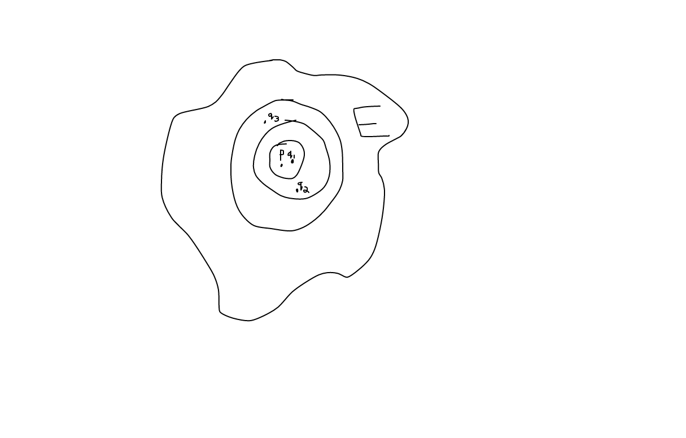
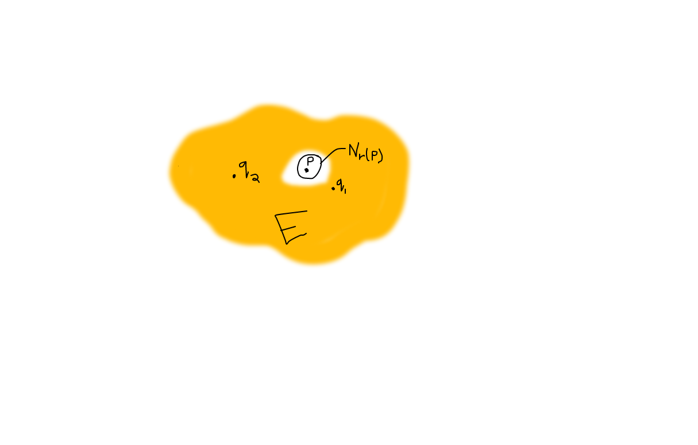
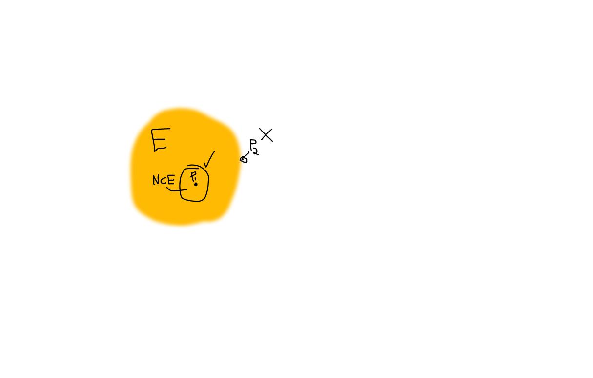
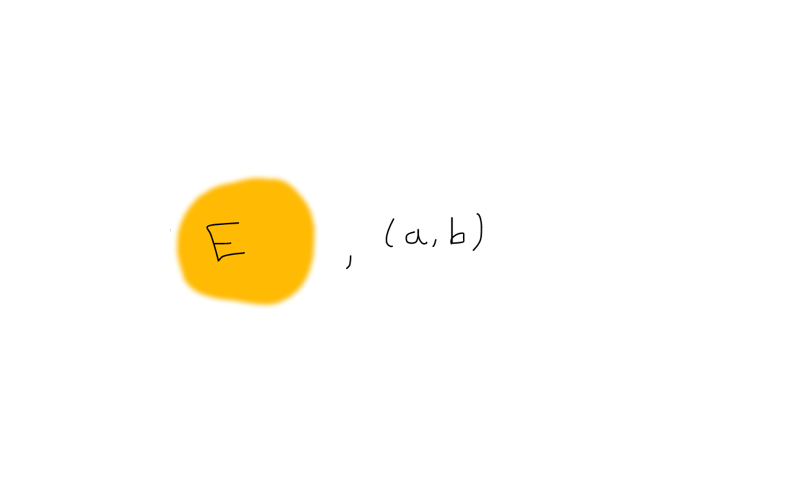

# Major Theorems and Definitions

## Definition 15
Here, we will visualize many of the new terms given in this definition.  For all of these definitions, $X$ is a metric space with a distance function $d$.

* Neighborhoods: a **neighborhood** of $p$ is a set $N_r(p)$ consisting of all $q$ such that $d(p,q) < r$ for some $r > 0$.  The number $r$ is the **radius** of $N_r(p)$.  

The below image helps to visualize a neighborhood in $E$.  

Note that $N_r(p)$ is not necessarily the entirety of the shaded orange region, but rather the collection of points $q_i$ within that region (representing a distance less than $r$ away from $p$).  

* A point $p$ is a **limit point** of the set $E$ if every neighborhood of $p$ contains a point $q \neq p$ such that $q \in E$.

Here, we can see that no matter the distance $r$ for each neighborhood, there still is a point $q_i$ in $N_r(p)$ where $q_i \in E$.  

* If $p \in E$ and $p$ is not a limit point of $E$, then $p$ is called an **isolated point**.

The essence of an isolated point is that there can be a radius $r$ such that $N_r(p)$ does not contain any point $q_i \in E$.  For example, $p$ below is an isolated point:

* $E$ is closed if every limit point of $E$ is a point of $E$.

The below are all examples of closed sets:

Note that the boundary of $E$ is contained in $E$, since the boundary is a limit point in this set $E$.  

* A point $p$ is an **interior** point of $E$ if there is a neighborhood $N$ of $p$ such that $N \subset E$.  

Note that in the below, point $p_1$ is in the interior of $E$, but point $p_2$ is not, since there is no neighborhood that surrounds point $p_2$ where $N \subset E$.  

* $E$ is **open** if every point of $E$ is an interior point of $E$.  

Below are examples of open sets:

Note that $E$ above does not contain its boundary.  This is because, if point $p$ were on the boundary of $E$, then there would be no radius $r > 0$ such that $N_r(p) \subset E$, as part of the neighborhood would be sticking out of $E$.  
