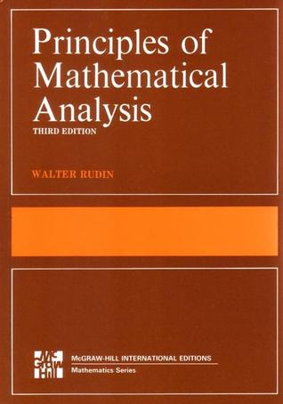

# Real Analysis

For my studies of real analysis, there seemed to be no better place to start than with Walter Rudin's _Principles of Mathematical Analysis_.  All of my mathematically-savy friends pointed me towards this book, and I was not disappointed.  While the layout of the text is dense, the textbook is rich with examples, practice problems, and is quite complete.  

This section of the webpage is devoted to visualizing several important theorems, as well as going through the proofs of selected theorems and problems for each chapter.  

